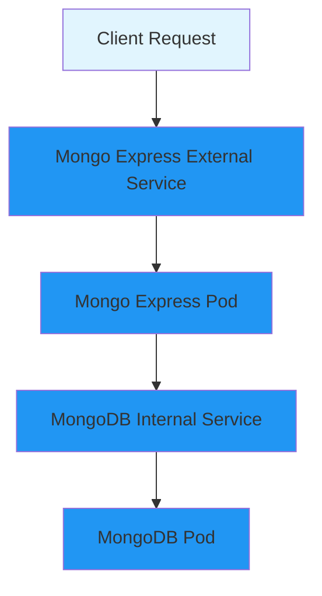
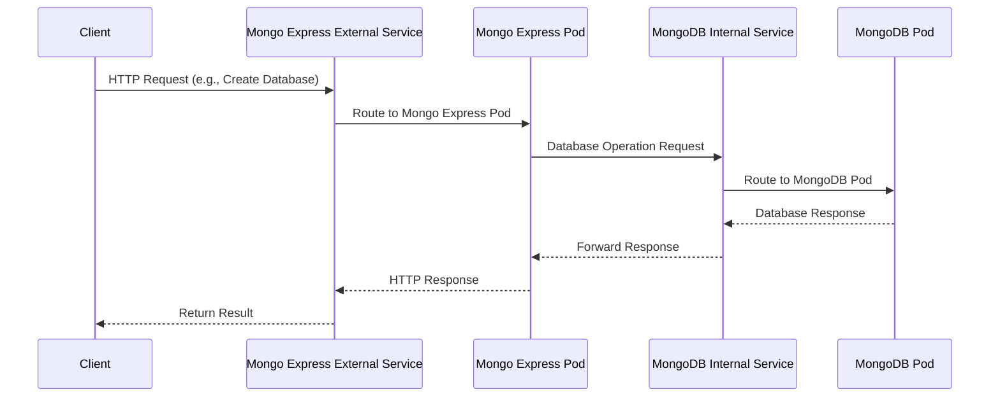

# MongoDB + Mongo Express Kubernetes Deployment

This project demonstrates how to deploy a MongoDB database with Mongo Express web interface using Kubernetes and Minikube.

## Architecture Overview

The application consists of the following components:

- **MongoDB Database**: A MongoDB instance running in a Kubernetes pod
- **Mongo Express**: A web-based MongoDB admin interface
- **Internal Service**: Routes traffic to MongoDB pod
- **External Service**: Exposes Mongo Express to external clients

## System Architecture



## Request Flow

When a client makes a request (e.g., to create a new database), the flow follows this path:



## Prerequisites

- [Minikube](https://minikube.sigs.k8s.io/docs/start/) installed
- [kubectl](https://kubernetes.io/docs/tasks/tools/) installed
- Docker daemon running

## Deployment Order

**Important**: The order of deployment is crucial due to dependencies between components. Follow this exact sequence:

### 1. Start Minikube

```bash
minikube start
```

### 2. Deploy Secrets (First Priority)

Secrets must be deployed first as they contain sensitive configuration data that other components depend on.

```bash
kubectl apply -f mongo-secret.yaml
```

### 3. Deploy ConfigMaps (Second Priority)

ConfigMaps contain non-sensitive configuration that services need to function properly.

```bash
kubectl apply -f mongo-configmap.yaml
```

### 4. Deploy Database Components (Third Priority)

Deploy MongoDB deployment and internal service. The database must be running before the application can connect to it.

```bash
kubectl apply -f mongo-deployment.yaml
```

### 5. Deploy Application Components (Fourth Priority)

Finally, deploy Mongo Express deployment and external service. This should be done last as the application depends on the database being available.

```bash
kubectl apply -f mongo-express-deployment.yaml
```

## Complete Deployment Script

You can run all commands in the correct order using this script:

```bash
#!/bin/bash

echo "Starting Minikube..."
minikube start

echo "Deploying Secrets..."
kubectl apply -f mongo-secret.yaml

echo "Deploying ConfigMaps..."
kubectl apply -f mongo-configmap.yaml

echo "Deploying MongoDB..."
kubectl apply -f mongo-deployment.yaml

echo "Deploying Mongo Express..."
kubectl apply -f mongo-express-deployment.yaml

echo "Waiting for all pods to be ready..."
kubectl wait --for=condition=ready pod -l app=mongodb --timeout=300s
kubectl wait --for=condition=ready pod -l app=mongo-express --timeout=300s

echo "Deployment complete!"
```

## Verification

### Check Pod Status

```bash
kubectl get pods
```

### Check Services

```bash
kubectl get services
```

### Access Mongo Express

```bash
minikube service mongo-express-service
```

This will open the Mongo Express web interface in your default browser.

## Component Details

### Secrets (`mongo-secret.yaml`)
- Contains MongoDB root username and password
- Base64 encoded credentials
- Referenced by both MongoDB and Mongo Express deployments

### ConfigMap (`mongo-configmap.yaml`)
- Contains database connection URL
- Non-sensitive configuration data
- Referenced by Mongo Express deployment

### MongoDB Deployment (`mongo-deployment.yaml`)
- MongoDB database container
- Internal service for database access
- Uses secrets for authentication

### Mongo Express Deployment (`mongo-express-deployment.yaml`)
- Web-based MongoDB admin interface
- External service (LoadBalancer) for web access
- Uses both secrets and configmap for configuration

## Troubleshooting

### Check Pod Logs

```bash
# MongoDB logs
kubectl logs -l app=mongodb

# Mongo Express logs
kubectl logs -l app=mongo-express
```

### Check Service Endpoints

```bash
kubectl get endpoints
```

### Restart Deployment

```bash
kubectl rollout restart deployment mongodb-deployment
kubectl rollout restart deployment mongo-express
```

## Cleanup

To remove all resources:

```bash
kubectl delete -f mongo-express-deployment.yaml
kubectl delete -f mongo-deployment.yaml
kubectl delete -f mongo-configmap.yaml
kubectl delete -f mongo-secret.yaml
minikube stop
```

## Security Notes

- The secrets in this demo contain base64-encoded plain text credentials
- In production, use proper secret management solutions
- Consider using Kubernetes secrets with proper encryption
- Implement network policies to restrict pod-to-pod communication
